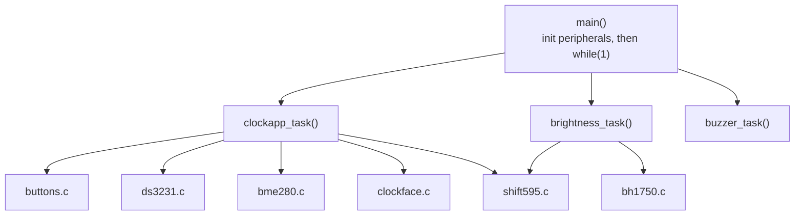

# BinaryClockV5 — Firmware Documentation

## Overview

BinaryClockV5 is a binary LED clock built on an STM32F030F6P6 (Cortex-M0, 16 KB flash, 4 KB RAM). It displays the time in BCD across 24 LEDs, and cycles through three more display modes on the same LED matrix: date, temperature/humidity, and a settable alarm.

- **Time keeping** — DS3231 RTC over I2C, battery-backed, resynced from hardware once a minute.
- **Environment** — BME280 gives temperature, humidity and barometric pressure (shown as a 5-position trend indicator).
- **Auto brightness** — BH1750 ambient-light sensor drives the LED brightness via PWM.
- **Alarm** — set through the DS3231's Alarm1, wired to an interrupt pin; a buzzer rings until acknowledged.
- **Input** — 4 buttons (MODE / PREV / NEXT / SET) read from a single ADC channel through a resistor ladder.

## Hardware

All three peripherals below share a single I2C1 bus.

| Component | Interface | Notes |
| --- | --- | --- |
| DS3231 RTC | I2C1, addr 0x68 | Battery-backed time/date + Alarm1; `ALARM_INPUT_Pin` reads its INT/SQW pin (active-low, open-drain — needs a pull-up) |
| BME280 | I2C1, auto-detects 0x76 or 0x77 | Temperature, humidity, pressure; chip ID (0x60) is checked on init |
| BH1750 | I2C1, auto-detects 0x23 or 0x5C | Ambient light in lux, drives auto-brightness |
| 3× 74HC595 | GPIO bit-bang (data/clock/latch) | 24 cascaded outputs drive the LED matrix; `/OE` is PWM'd from TIM14 for brightness |
| Buzzer | GPIO push-pull | Simple on/off drive (no tone generation), used for the alarm |
| Buttons (MODE/PREV/NEXT/SET) | 1 ADC channel | Resistor ladder — each button pulls the ADC reading into its own voltage band, decoded in `buttons.c` |

MCU: STM32F030F6P6, 16 KB flash / 4 KB RAM. Debug probe: ST-Link over SWD.

## Architecture

On boot, `main()` initializes every peripheral once, then runs an unbounded loop calling three tasks every iteration — no RTOS, no interrupts driving the logic (buttons and sensors are all polled).



- **`clockapp_task()`** ([clockapp.c](Core/Src/clockapp.c)) is the state machine: reads buttons, keeps/syncs the time, cycles the 4 display modes, and on every change rebuilds the 24-bit LED frame and pushes it out.
- **`brightness_task()`** ([brightness.c](Core/Src/brightness.c)) periodically reads ambient light and smoothly adjusts LED brightness via PWM.
- **`buzzer_task()`** ([buzzer.c](Core/Src/buzzer.c)) drives the alarm beep pattern without blocking the loop.

## Display frame format

`face_build()` in [clockface.c](Core/Src/clockface.c) packs everything the LEDs show into one 24-bit frame, shifted out MSB-first through the 74HC595 chain. The 24 bits are used exactly, with no gaps:

| Field | Bit(s) | Width | Meaning |
| --- | --- | --- | --- |
| `FACE_BIT_ALARM` | 0 | 1 | Alarm-enabled indicator |
| `FACE_SHIFT_H_TENS` | 1–2 | 2 | Hours, tens digit (0–2) |
| `FACE_SHIFT_H_UNITS` | 3–6 | 4 | Hours, units digit (0–9) |
| `FACE_SHIFT_M_TENS` | 7–10 | 4 | Minutes, tens digit (0–5) |
| `FACE_SHIFT_M_UNITS` | 11–14 | 4 | Minutes, units digit (0–9) |
| `FACE_SHIFT_MODE` | 15–18 | 4 | One-hot bit for the active display mode |
| `FACE_SHIFT_BARO` | 19–23 | 5 | One-hot bit for the barometric trend zone |

Date and temperature/humidity modes reuse the same hour/minute fields — `compose()` just passes day/month or temperature/humidity in place of hours/minutes.

**Two wiring compensations live in this file**, both there because of how the LED matrix is actually soldered rather than any RTC/sensor quirk:

- `field()` mirrors each digit's bits within its slot (`width - 1 - i` instead of `i`) to match the matrix's bit order.
- `mu_fix` in `face_build()` additionally swaps bits 0 and 1 of the minutes-units digit, because those two LEDs are cross-wired on the matrix.

If the matrix is ever re-soldered, these are the two places to revisit.

## Display modes and buttons

MODE cycles through 4 display modes. Within a mode, SET/NEXT/PREV behave differently depending on whether the mode supports editing:

| Mode | Shows | SET / NEXT / PREV |
| --- | --- | --- |
| Time | Current hours : minutes | SET enters edit (hours, then minutes); NEXT/PREV change the blinking field; SET again confirms and writes the new time to the DS3231 |
| Date | Day . month from the RTC | Read-only display, re-read once a second |
| Temp / humidity | Whole °C and % RH from the BME280 | Read-only display, re-read once a second |
| Alarm | Alarm hours : minutes | NEXT/PREV toggle the alarm on/off; SET enters the same hours/minutes edit as Time mode, writing to DS3231 Alarm1 on confirm |

When the alarm fires, any button press (or a 60-second timeout) silences it and disables it for the next day — it's a one-shot alarm, not a daily recurring one.

Buttons are read from a single ADC pin wired as a resistor ladder (`buttons.c`): each button pulls the reading into its own voltage band, decoded with fixed thresholds, then debounced for 20 ms before an edge is reported.

## Build and flash

**Build** — CMake + Ninja, ARM GCC toolchain (bundled with STM32CubeIDE):

```
cmake --build build/Release
```

Produces `build/Release/BinaryClockV5.elf`. Current usage: ~88% of 16 KB flash, ~48% of 4 KB RAM.

**Flash / debug** — ST-Link over SWD, via OpenOCD:

1. Stop `stlink-server` first — it holds the USB device exclusively and blocks OpenOCD from attaching.
2. [openocd.cfg](openocd.cfg) currently sources `interface/cmsis-dap.cfg`; for the ST-Link probe used on this board, pass `interface/stlink.cfg` explicitly:
   ```
   openocd -f interface/stlink.cfg -f target/stm32f0x.cfg -c "adapter speed 500"
   ```
3. With OpenOCD's GDB server running on port 3333, `arm-none-eabi-gdb` can flash, halt/resume, and call firmware functions directly (used during bring-up to read the RTC, the BME280, and to set/read the alarm without writing a separate test harness).
